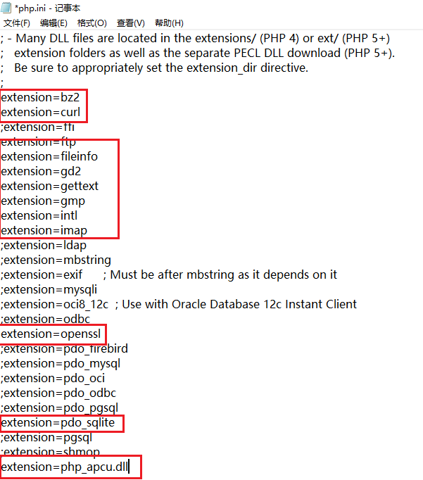

# 搭建漏洞网站及XSS攻击
## 1 实验要求
* 编写漏洞网页，使之可以进行 XSS 攻击
## 2 实验过程
[完整过程参考](https://www.bilibili.com/video/BV1oE411V7xz?from=search&seid=13933215547277478486)  
###  VSCode 搭建 PHP 开发环境
* **安装 PHP**
    * 在 http://windows.php.net/download/ 下载 PHP
    
    * 将下载的压缩包移动到`C:\php`并解压
    * 在`C:\php`文件夹下新建文件`php.ini`，内容与解压出的`php.ini-production`文档内容相同。
    * 修改部分`php.ini`内容  
    取消对以下内容的注释及修改：
    ```
    extension_dir = "C:/PHP/ext"
    ```
      
    * 将`C:\PHP`添加到环境变量中

## 3 实验结果
表单中填写`<script>alert('hack')</script>`将出现弹窗