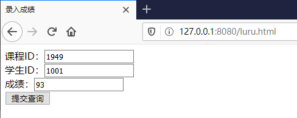

# sqlite库编程
## 1 实验要求
在`httpserver.py`的基础上：
* 编写教师录入成绩页面
  * 课程id、学生id、成绩
* 编写学生查询成绩页面
  * 输入学生id或课程id查询
## 2 实验过程
### 2.1 建立数据库
```bash
sqlite3.exe edu.db
sqlite> .table
sqlite> create table stuinfo(course_id INTEGER,student_id INTEGER,grades INTEGER);
sqlite> .table
```
  
### 2.2 修改`httpserver.py`并完成录入成绩和查询成绩功能
内容详见`code`文件夹下的`httpserver-imp.py`、`chaxun.html`、`luru.html`三个文档。  
## 3 实验结果
* 录入学生及课程信息  
  
(这里按钮上的文字，明明写的是 **录入信息** ，但是网页上却显示 **提交查询** ，我使用火狐浏览器的web开发者相关功能进行查看，发现里面的网页源代码中仍是 **录入信息** 。但是不影响功能，于是我没深究原因。)
* 录入成功  
  
* 查询学生及课程信息  
  
* 查询成功  
  
