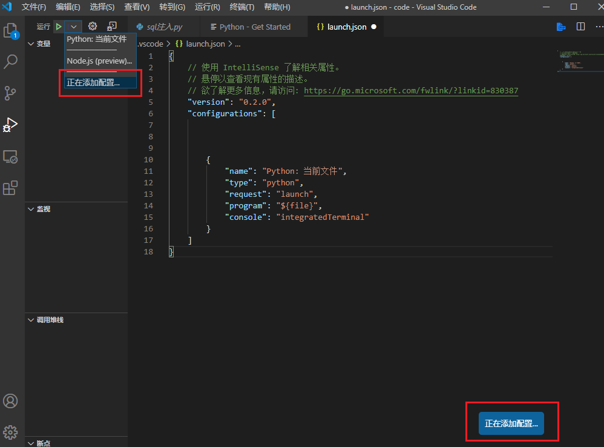
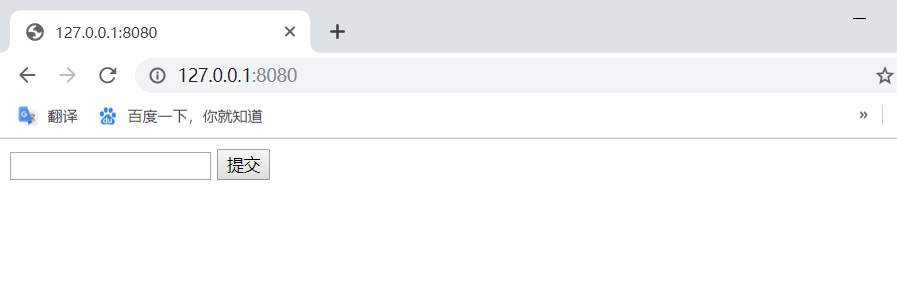
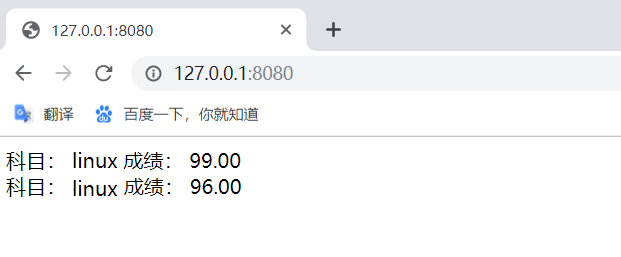

# SQL注入
[老师仓库](https://code.aliyun.com:fwqcuc/soft-sec.git)  
## 内存管理
* 以4MB（页）作为基本管理单元的虚拟内存管理。
* 虚拟内存管理是一套虚拟地址和物理地址对应的机制。
* 程序访问的内存都是虚拟内存地址，由CPU自动根据系统内核区中的地址对应关系表（分页表）来进行虚拟内存和物理内存地址的对应。
* 每个进程都有一个分页表。
* 每个进程都有一个完整的虚拟内存地址空间，x86情况下为4GB（0x00000000-0xffffffff）
* 但不是每个地址都可以使用（虚拟内存地址没有对应的物理内存）
* 使用VirtualAlloc API可以分配虚拟内存（以页为单位）、使用VirtualFree释放内存分页。
* 使用VirtualProtect 修改内存也保护属性（可读可写可执行）
* 数据执行保护（DEP）的基本原理
* malloc和free等C函数（也包括HeapAlloc和HeapFree等）管理的是堆内存，堆内存区只是全部内存区的一个部分。
* 堆内存管理是建立在虚拟内存管理的机制上的二次分配。
* 真正的地址有效还是无效是以分页为单位的。
* 内存分页可以直接映射到磁盘文件（FileMapping）、系统内核有内存分页是映射物理内存还是映射磁盘文件的内存交换机制。
### sql_injection.py
* 这个文件是一个独立的httpserver，因此和django没有什么关系。它的运行就是独立运行py文件。
* 在调试界面，点击 “增加配置”，选`python 当前文件`配置`launch.json`  
  
* 用这种方式可以调试`sql_injection`,然后点击`sql_inejction`文件，使其成为编辑器的当前文件。将自己的`db.sqlite3`进行覆盖，点击绿色箭头，就可以调试了。运行以后，访问http://127.0.0.1:8080/ ，是一个编辑框，输入学生ID，查询对应的成绩。                
                             
                              
* 通过直接查询数据库，我们知道当前的用户的ID是`1`，所以输入`1`，查询。返回了用户`id 1`的成绩
* 提交`1 OR 1= 1`,查出了当前系统中所有用户的成绩。相当于整个数据库我都获得了。                                               
                                 
* 问题在代码的43行，我们直接把用户输入的数据，作为sql语句中的查询条件。
* 最后的输入的sql语句为：
```sql
SELECT edu_admin_course.name, edu_admin_score.score FROM edu_admin_score INNER JOIN edu_admin_course ON edu_admin_score.course_id=edu_admin_course.id WHERE student_id = 1 OR 1=1
```
查询条件变成了`student_id = 1 OR 1=1`,`1=1`恒为真即相当于 
```sql
SELECT edu_admin_course.name, edu_admin_score.score FROM edu_admin_score INNER JOIN edu_admin_course ON edu_admin_score.course_id=edu_admin_course.id WHERE true;
```
若没有WHERE,变成了无条件查询,于是显示出了数据中的所有记录。

## 总结
* 在软件安全中，有一个原则，所有用户的输入都是不可信的。因此，我们必须对用户输入进行过滤，进行严格的限制，从而避免一些恶意输入。
* 过滤有两种方法：                   
    * 就是对用户输入进行过滤，比如这里。我们可以判断一下 input_data是否数字就可以。用python内置函数 isdigit
    * 使用参数化查询语句。不将用户的输入作为SQL指令的一部分处理，而是在完成SQL指令的编译后，才套用参数执行
* 但是对于大型的系统，会有很多sql语句拼接和执行的地方。每一个都去过滤，编程效率很低，而且不一定能保证你写的过滤就是对的。实际系统的业务远比我们这里输入ID要复杂。
* 这就是框架ORM的意义了。ORM完全避免了程序员直接接触sql语言，所有的sql语句都在模型管理器中有框架进行拼接。程序员在编程时，只需要使用模型管理器提供的方法进行查询，创建等，就可以了。比如，之前写的Django代码。
```py
result = Score.objects.filter(student=request.user)
```
底层在进行sql的拼接,就避免了这种情况
* Django的模型管理器中，主要有filter get等获取数据的方法。这些方法返回的数据类型是QuerySet数据类型。这个数据类型是一个数据库访问的接口。在调用filter时，实际上还未查询数据库，只是初步完成了数据库sql语句的拼接。
* 实际的查询是在`render`中进行的。Django会根据`render`时需要的具体数据，来精确优化查询语句，所有这里的result，并不是真正的查询结果。而是一个查询对象。
* 在模板` score.html` 用到了` {{ i.course.name }}.course`是 `socre`表的一个外键，`course.name`实际是在`course`表中。所有这里其实是一个跨表查询。这种两个表的跨表查询，我们自己写的sql语言已经比较复杂了。真实系统往往会有多个表的联合跨表查询，sql语句会非常复杂。但是Django处理后，查询数据库的操作就变得非常简单，把数据中的直接访问变成了python对象的属性访问。