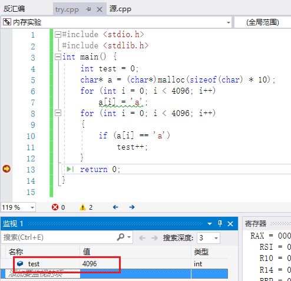
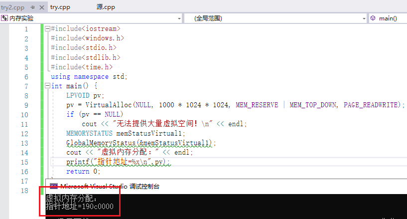
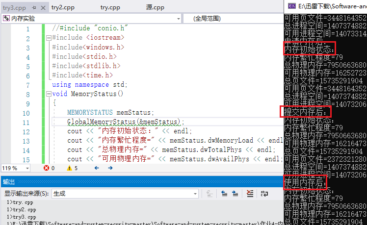

# 内存管理
## 1 实验要求
* 阅读 VirtualAlloc、VirtualFree、VirtualProtect 等函数的官方文档
* 编程使用`malloc`分配一段内存，测试这段内存所在的整个 4KB 区域是否都可以写入读取
* 使用 VirtualAlloc 分配一段可读可写的内存，写入内存，然后将这段内存改为只读，再读数据和写数据，看是否会有异常情况。接着 VirtualFree 这段内存，再测试对这段内存的读写是否正常。
## 2 实验过程
### 2.1 编程使用`malloc`分配一段内存，测试这段内存所在的整个 4KB 区域是否都可以写入读取  
4KB=4096个char型数据。  
  
运行结束后test=4096，即4KB空间都可以进行读取。
### 2.2 使用VirtualAlloc分配一段可读可写的内存，写入内存，然后将这段内存改为只读，再读数据和写数据，看是否会有异常情况。然后VirtualFree这段内存，再测试对这段内存的读写释放正常  
*   
    一段可读可写的内存分配成功。  
*   
    由 VirtualAlloc 分配的 内存（可读可写）内存可以正常的写入和读取。
* 新增 VirtualProtect 函数，修改一段内存的访问属性  
   VirtualProtect (PVOID 基址，SIZE_T 大小，DWORD 新属性，DWORD 旧属性)
    ```bash
    vp = VirtualProtect(
      lpv,
      PAGELIMIT * dwPageSize,	 // 需要改变访问属性的区域大小
      PAGE_READONLY,           // 只读
      &oldProtect	             // 在修改前，旧的访问属性将被存储
    );
    ```   
    再次执行后：将引发写入访问异常。  
  * 更改一页的页面属性，改为只读后无法访问，还原后可以访问
    ```bash
    DWORD protect;
    iP[0]=8;
    VirtualProtect(lpv,4096,PAGE_READONLY,&protect);
    int * iP=(int*)pV;
    iP[1024]=9;                      //可被访问，因为不在该页
                                     //iP[0]=9：不可访问，只读
    //还原保护属性
    VirtualProtect(lpv,4096,PAGE_READWRITE,&protect);
    cout<<"初始值="<<iP[0]<<endl;    //可访问
    ```
    再次执行后：将访问属性修改为`PAGE_READONLY`后，该段内存将无法写入，但仍能正常读取。  

   * 释放内存代码
   
    ```bash
    //只释放物理内存
    VirtualFree((int*)pV+2000,50*1024*1024,MEM_DECOMMIT);
    int* a=(int*)pV;
    a[10]=2;//可以使用，没有释放这一页
    MEMORYSTATUS memStatusVirtual3;
    GlobalMemoryStatus(&memStatusVirtual3);
    cout<<"物理内存释放："<<endl;
    cout<<"增加物理内存="<<memStatusVirtual3.dwAvailPhys-memStatusVirtual2.dwAvailPhys<<endl;
    cout<<"增加可用页文件="<<memStatusVirtual3.dwAvailPageFile-memStatusVirtual2.dwAvailPageFile<<endl;
    cout<<"增加可用进程空间="<<memStatusVirtual3.dwAvailVirtual-memStatusVirtual2.dwAvailVirtual<<endl<<endl;
    ```
    再次执行后：内存释放后将无法读取和写入。